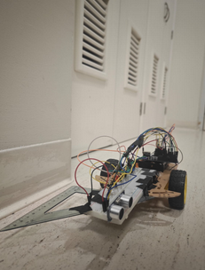
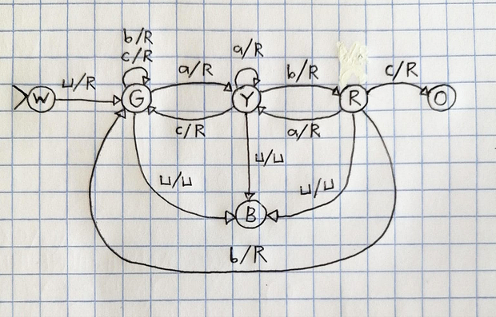
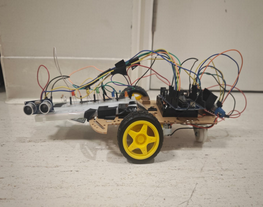
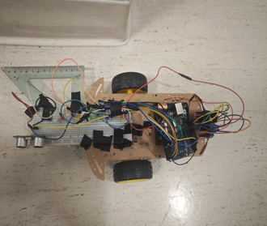
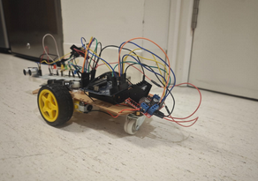

# Arduino Turing Machine Car 🚗🤖

A physical implementation of a Turing Machine using an Arduino-controlled car that reads symbols based on distance measurements and validates sequences according to formal automaton rules.



## 🎬 Demo Video


*The car in action - reading symbols, changing states, and validating sequences*

---

**Want better quality?** [▶️ Watch the full MP4 video](videos/demo.mp4)

## 🎯 Project Overview

This project combines theoretical computer science with robotics by implementing a **Deterministic Finite Automaton (DFA)** that:
- Uses an ultrasonic distance sensor to "read" symbols (a, b, c, space)
- Processes input sequences according to Turing Machine transition rules
- Physically moves forward after each symbol is read
- Validates sequences and rejects those containing the pattern "abc"
- Provides visual feedback through colored LEDs representing different states

## 🧠 How It Works

### Symbol Detection
The ultrasonic sensor maps distance ranges to symbols:
- **Symbol 'a'**: 0-20 cm
- **Symbol 'b'**: 20-40 cm  
- **Symbol 'c'**: 40-60 cm
- **Space ' '**: 60-200 cm (also acts as terminator)

### State Machine Logic
The Turing Machine has 6 states, each represented by an LED:

| State | LED Color | Description |
|-------|-----------|-------------|
| `w` (white) | White | Initial/start state |
| `g` (green) | Green | State after reading first space |
| `y` (yellow) | Yellow | State after detecting 'a' |
| `r` (red) | Red | State after detecting 'ab' sequence |
| `b` (blue) | Blue | **Accepted** - Valid sequence completed |
| `o` (orange) | Orange | **Rejected** - 'abc' pattern detected |

### Transition Rules
The machine validates sequences by checking for the forbidden "abc" pattern:

**From Start (white):**
- Space → green (begin processing)

**From Green:**
- 'a' → yellow
- 'b' or 'c' → green (stays)
- Space → blue (accept)

**From Yellow:**
- 'a' → yellow (stays)
- 'b' → red (danger: 'ab' detected)
- 'c' → green (reset)
- Space → blue (accept)

**From Red:**
- 'a' → yellow (reset)
- 'b' → green (reset)
- 'c' → **orange** (reject: 'abc' found!)
- Space → blue (accept)



## 🔧 Hardware Requirements

### Materials List

| Quantity | Component | Description |
|----------|-----------|-------------|
| 1 | Car chassis | Transparent acrylic as main base |
| 2 | Gear motors | 1:48 ratio, balance between speed and torque |
| 2 | Wheels | For rear-wheel drive |
| 1 | Front caster wheel | Front support |
| 1 | 4x AA battery holder | Motor power supply |
| 1 | L298N H-Bridge | Motor direction and speed control |
| 1 | Arduino Uno | Main microcontroller with USB cable |
| 1 | Switch | On/off power control |
| 1 | Bracket | Structural support |
| 6 | LEDs | Different colors (white, green, yellow, red, blue, orange) |
| 6 | Resistors | 220Ω for LED protection |
| 1 | HC-SR04 sensor | Ultrasonic distance sensor |

### Car Views

<table>
<tr>
<td></td>
<td></td>
</tr>
<tr>
<td></td>
<td></td>
</tr>
</table>

## 📌 Pin Configuration

### Distance Sensor (HC-SR04)
- `TRIG_PIN`: Digital Pin 6
- `ECHO_PIN`: Digital Pin 5

### LEDs
- `LED_WHITE`: A0 (Start state)
- `LED_GREEN`: A3 (State 'a')
- `LED_YELLOW`: A4 (State 'b')
- `LED_RED`: A5 (State 'c')
- `LED_BLUE`: A1 (Accepted)
- `LED_ORANGE`: A2 (Rejected)

### Motor Controller (L298N)
- `IN_1`: Digital Pin 10
- `IN_2`: Digital Pin 11
- `EN_A`: PWM Pin 9
- `IN_3`: Digital Pin 12
- `IN_4`: Digital Pin 13
- `EN_B`: PWM Pin 3

## 🚀 Setup & Installation

### Prerequisites
- Arduino IDE or Arduino CLI
- USB cable for Arduino connection
- 4 AA batteries for motor power supply

### Upload Instructions

1. **Clone or download this repository**

2. **Using Arduino IDE:**
   ```bash
   # Open carTm.ino in Arduino IDE
   # Select Board: Tools → Board → Arduino Uno
   # Select Port: Tools → Port → /dev/ttyACM0 (or your port)
   # Click Upload

